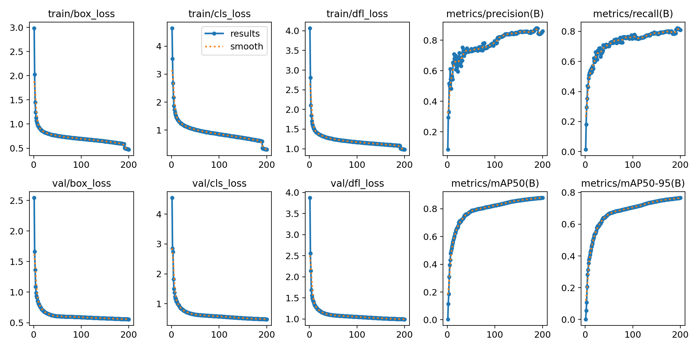

# FitDetect: Outfit Detection/Recommendation Engine

Web app and fashion detection/recommendation engine that leverages deep learning, computer vision, and LLM's to provide outfit recommendations. Application uses a YOLOv8 object detection model trained to identify clothing on a user either through their webcam or a user-uploaded photo. Then feeds detected outfit to OpenAI's gpt-4o-mini LLM to provide recommendations to improve the user's style. Check out deployed website here: https://fitdetect.netlify.app/

## Table of Contents

- [Methods](#methods)
- [Technologies Used](#technologies-used)

## Methods

### Training model
- Went with Ultralytic's [YOLOv8 object detection model](https://github.com/ultralytics/ultralytics) which made training the model simple yet still yielded accurate predictions.
- Curated and prepared data to be used to train the model from the [DeepFashionV2 dataset](https://openaccess.thecvf.com/content_CVPR_2019/papers/Ge_DeepFashion2_A_Versatile_Benchmark_for_Detection_Pose_Estimation_Segmentation_and_CVPR_2019_paper.pdf). This included organizing the data into train/validation sets and creating labels that satisfied YOLOv8's annotation format. Total dataset ended up being around 32,000 images and their corresponding labels.
- Trained model on the curated images/labels in 200 epochs. My laptop struggled to do this in a reasonable amount of time, but thankfully I was able to leverage my school's CUDA cluster servers via SSH to complete this task.

### Training Results

### Creating Application
- Used computer vision tools [OpenCV](https://opencv.org/) and Roboflow's [Supervision](https://github.com/roboflow/supervision) to handle frames captured from user's webcam and draw bounding boxes/labels on clothing detections.
- Determined what user was wearing based off of detected clothing. Added logic to try and filter out any inaccurate predictions the model made.
- Determined the dominant color of each piece using a k-means clustering algorithm from [SciPy](https://scipy.org/) in order to get a better idea of what the user's outfit looks like.
- Engineered prompts to feed to the gpt-4o-mini model through OpenAI's API to ensure consistent format and helpful outfit recommendations.
- Configured a WebSocket to stream frames captured on webcam from front end to back end and stream frames with labels/bounding boxes drawn back simultaneously. This way the user can see what objects the model is detecting in real-time.
- Maintaining low latency between the front end and back end proved to be difficult once I deployed my API to Railway, but I was able to subjugate it by lowering the resolution and frame rate of the video on the front end. 
- Added feature to allow user-uploaded photos to get outfit recommendations for as well.

## Technologies Used

### Front End
- **React.js**
- **Vite**
- **CSS5**
- **Netlify for hosting**

### Back End
- **Python**
- **FastAPI**
- **Railway for hosting API**

### Data Processing
- **Python**
- **Ultralytics' YOLOv8 model**
- **OpenCV**
- **Roboflow's Supervision**
- **SciPy's clustering package**
- **OpenAI API**

